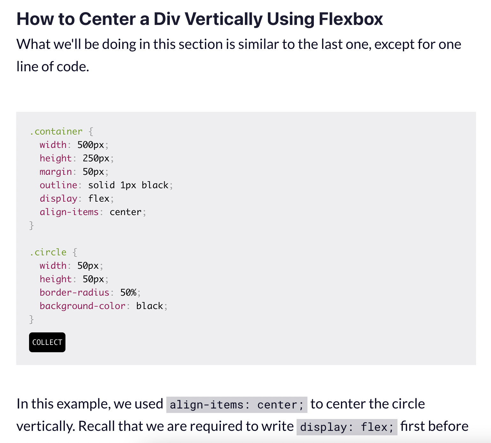
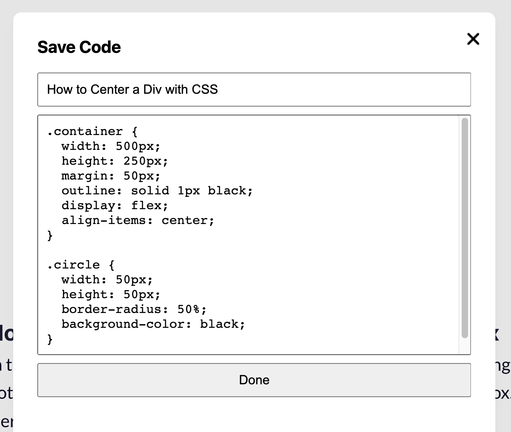

<!-- PROJECT TITLE -->
<div align="center">
  <h3 align="center">Code Collector - Chrome Extension V3</h3>
  <p align="center">
    Save code snippets from every website and manage your code collection
  </p>
</div>
<br/>
<!-- ABOUT THE PROJECT -->

## About the project

As developers, we surf the web looking for resources and often come across code snippets. Most of these fragments end up lost in your program's countless lines of code.

Code Collector aims to make that process easier.

<br/>

## How dois it work?

If the website you visit has a code snippet. A button will appear to capture it.
Also by accessing your account you can see, edit, delete your code snippets.




<br/>

## Built with

- JavaScript
- HTML
- CSS

<!-- GETTING STARTED -->
<br/>

## Getting started

As a starting point we recommend you take a look at the official google documentation fot Chrome Extensions:
https://developer.chrome.com/docs/extensions/mv3/getstarted/

<br/>

## Installation and usage

_Below is an example of how you can install this app. This project doesn't rely on any external dependencies._

1. Clone the repo
   ```
   git clone https://github.com/Dev4Society/code-collector.git
   ```
2. Open Google Chrome and navigate to:
   ```
   chrome://extensions/
   ```
3. At the top right, turn on Developer mode.

4. Click Load unpacked.

5. Find and select the extension folder 'code-collector'.

7. Open a new tab, find a code and capture it.

<br/>
<!-- ROADMAP -->

## Roadmap

- [x] Add collect button.
- [x] Add modal to edit and save code.
- [ ] Add user authentication (Firebase Auth)
- [ ] Add store (Firebase Cloud Storage)
- [ ] Add popup to display snippets

<br/>
<!-- CONTRIBUTING -->

## Contributing

Contributions are **greatly appreciated**.

If you have a suggestion that would make this better, please fork the repo and create a pull request. You can also simply open an issue with the tag "enhancement".
Don't forget to give the project a star! Thanks!

1. Fork the Project
2. Create your Feature Branch (`git checkout -b feature/AmazingFeature`)
3. Commit your Changes (`git commit -m 'Add some AmazingFeature'`)
4. Push to the Branch (`git push origin feature/AmazingFeature`)
5. Open a Pull Request
<br>

<!-- LICENSE -->
## License

Distributed under the MIT License. See `code-collector/LICENSE` for more information.

<br/>

<!-- CONTACT -->
## Contact

Oscar Gonzalez - [@oscardev_](https://twitter.com/oscardev_)

Repository Link: [https://github.com/Dev4Society/code-collector](https://github.com/Dev4Society/code-collector)


<p align="right">(<a href="#readme-top">back to top</a>)</p>